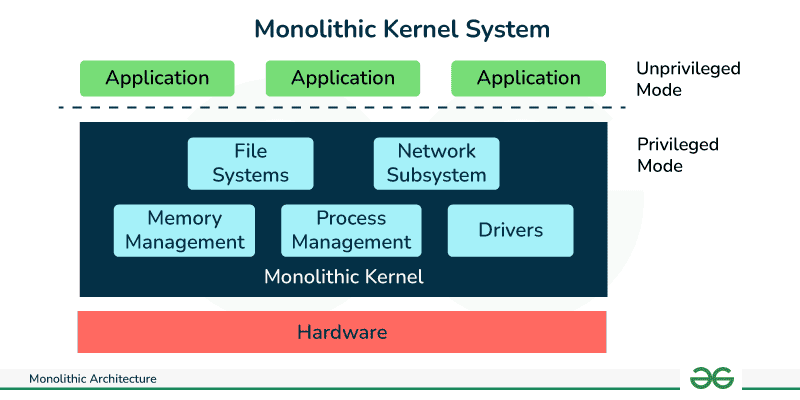
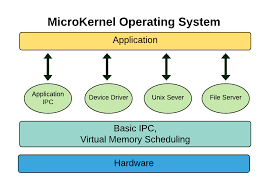

### What is an Operating System (OS)?

An operating system (OS) is a crucial software that manages computer hardware and software resources and provides common services for computer programs. It acts as an intermediary between users and the computer hardware. Here’s a detailed explanation of its functions and importance.

---

#### Definition and Purpose

**Definition**: An operating system is system software that manages computer hardware, software resources, and provides common services for computer programs. It is an essential component of the system software in a computer system.

**Purpose**:

- **Resource Management**: Manages hardware resources like CPU, memory, disk drives, and printers.
- **User Interface**: Provides a user interface, such as a command-line interface (CLI) or graphical user interface (GUI), to interact with the system.
- **Application Execution**: Facilitates the execution of application programs by providing necessary services.
- **Security and Access Control**: Ensures authorized access to data and resources.
- **File Management**: Manages files on different storage devices.

---

#### Key Functions of an Operating System

1. **Process Management** 📝

   - **Definition**: The OS handles the creation, scheduling, and termination of processes.
   - **Importance**: Ensures efficient execution of multiple processes through multitasking, allowing multiple programs to run simultaneously.
2. **Memory Management** 💾

   - **Definition**: The OS manages the system’s memory, keeping track of each byte in a computer's memory and ensuring efficient use.
   - **Importance**: Allocates memory to processes when needed and frees it when not in use, preventing memory leaks and ensuring optimal performance.
3. **File System Management** 📁

   - **Definition**: Manages files on storage devices, including creation, deletion, reading, writing, and organizing files.
   - **Importance**: Provides a way to store and retrieve data systematically, ensuring data integrity and security.
4. **Device Management** 🖨️

   - **Definition**: Manages device communication via their respective drivers.
   - **Importance**: Facilitates the operation of peripheral devices (printers, disk drives, etc.) by providing an interface between the hardware and application software.
5. **Security and Access Control** 🔐

   - **Definition**: Ensures system security by preventing unauthorized access to the system’s resources.
   - **Importance**: Protects user data and system resources from malicious attacks and unauthorized access.
6. **User Interface** 🖥️

   - **Definition**: Provides interfaces for users to interact with the computer system.
   - **Types**:
     - **CLI (Command-Line Interface)**: Text-based interface where users type commands.
     - **GUI (Graphical User Interface)**: Visual interface with graphical elements like windows, icons, and buttons.
   - **Importance**: Enhances user experience by making it easier to interact with the system.
7. **Networking** 🌐

   - **Definition**: Manages network connections and data transfer between devices.
   - **Importance**: Facilitates communication and resource sharing between multiple systems in a network.
8. **Error Detection and Handling** 🛠️

   - **Definition**: Monitors the system for errors and takes appropriate action.
   - **Importance**: Ensures system reliability and stability by handling errors gracefully.

---

#### Types of Operating Systems

1. **Batch Operating Systems** 🗂️

   - **Definition**: Processes batches of jobs with minimal user interaction.
   - **Examples**: Early mainframe systems.
2. **Time-Sharing Operating Systems** ⏱️

   - **Definition**: Allows multiple users to use the system simultaneously by sharing time on the CPU.
   - **Examples**: Unix, Multics.
3. **Distributed Operating Systems** 🌍

   - **Definition**: Manages a group of distinct computers and makes them appear as a single coherent system.
   - **Examples**: Amoeba, Plan 9.
4. **Embedded Operating Systems** 📟

   - **Definition**: Designed for embedded systems, which are computers embedded in other devices.
   - **Examples**: VxWorks, RTOS for microcontrollers.
5. **Real-Time Operating Systems (RTOS)** ⏲️

   - **Definition**: Ensures tasks are completed within a certain time frame, suitable for time-critical applications.
   - **Examples**: QNX, FreeRTOS.
6. **Network Operating Systems** 🌐

   - **Definition**: Manages network resources and enables sharing of resources over a network.
   - **Examples**: Novell NetWare, Windows Server.
7. **Mobile Operating Systems** 📱

   - **Definition**: Designed specifically for mobile devices.
   - **Examples**: Android, iOS.

---

#### Why We Need Operating Systems

1. **Efficient Resource Utilization** 🌟

   - Manages hardware resources efficiently to maximize performance and minimize waste.
2. **User Convenience** 💁

   - Provides an interface that makes it easy for users to interact with the computer, execute programs, and manage files.
3. **System Security and Stability** 🔒

   - Protects the system from unauthorized access and ensures stable and reliable operation.
4. **Application Support** 📦

   - Provides a platform for running various application software, making it easier for developers to create and execute programs.
5. **Networking Capabilities** 📡

   - Enables networking functionalities, allowing multiple computers to communicate and share resources.
6. **Error Handling and Recovery** 🛡️

   - Detects and handles errors effectively to prevent system crashes and data loss.

---

### Basic Concepts of Operating Systems

Understanding the fundamental concepts of operating systems (OS) is essential for grasping more advanced topics. Here, we will delve into the structure of operating systems, processes, and threads, providing detailed yet simple explanations.

---

#### 1. **Operating System Structure**

🧠 **Kernel Mode**: When the CPU operates in kernel mode, it has all the powers! 🛡️ It can execute special commands called privileged instructions. These are like VIP passes that allow the CPU to perform critical tasks that regular programs can't, such as managing how memory is protected and shared. This mode ensures that sensitive operations are secure and don't mess up the system or interfere with other programs.

👤 **User Mode**: This is the CPU's everyday mode when it's running user applications like your web browser or a game. In user mode, the CPU doesn`t have the special powers it has in kernel mode. This keeps things safe because regular programs can't perform actions that could potentially disrupt the system. User programs can execute common instructions like ADD (adding numbers) and PUSH (moving data), but they can't fiddle with system-level functions.

🔄 **Switching Modes**: The operating system switches the CPU between these modes. It puts the CPU into kernel mode when it needs to do something important and system-related (like handling memory or accessing hardware). When you're just running regular apps, the CPU stays in user mode to keep things safe and stable.

This switching ensures everything on your computer runs smoothly without any program stepping out of line and messing with critical system functions! 😊

Operating systems can be organized in various structures, each with unique characteristics. The main types are Monolithic, Microkernel, Modular, and Hybrid systems.

**Monolithic Systems** 🏢

- **Definition**: In a monolithic system, the entire operating system works in the kernel space. All OS services like process management, file system management, and memory management are part of the kernel.
- **Examples**: Traditional Unix, early Linux versions.
- **Advantages**:

  - **Performance**: Since all components run in the same address space, system calls and operations are fast due to minimal overhead.
  - **Simplicity**: Easier to implement in terms of a single, large block of code.
- **Disadvantages**:

  - **Maintenance**: Hard to maintain and debug due to the tight integration of all system components.
  - **Stability**: A bug in one part of the kernel can crash the entire system.

  

**Microkernel Systems** 🧩

    A microkernel is a type of kernel, which is essentially the core of an operating system, responsible for managing system resources. Unlike traditional monolithic kernels that bundle many services together, a microkernel keeps things minimal and separate.

🔍 **Structure**: In a microkernel architecture, system services are divided into two main categories:

1. **Kernel Services**: These are essential services like memory management, CPU scheduling, and inter-process communication. They are kept in a secure kernel address space.
2. **User Services**: These are less critical services, kept in the user address space, separate from the kernel space.

🔄 **Communication**: Services communicate via message passing, which is secure but can be slower than direct function calls used in monolithic kernels.

🛡️ **Advantages**:

- **Isolation**: Since user services are separated from kernel services, if a user service fails, it won't crash the entire system. This isolation enhances stability.
- **Extensibility**: It’s easy to add new services without modifying the kernel; just add them to the user space.
- **Portability and Security**: With fewer services running in kernel mode, there’s less code that can cause security vulnerabilities, making the system more secure and easier to adapt to different hardware.

📦 **Examples**: Some operating systems built on microkernel architecture include L4, QNX, and MINIX.

🔧 **Microkernel Architecture Explained**: At its core, the microkernel handles only the most vital services. All other services, deemed less critical, are managed by system applications, allowing users to interact with these services without stressing the kernel. This design choice prioritizes critical system functionalities while keeping the kernel lean and mean.

By focusing on crucial tasks and keeping other services separate, microkernels offer a streamlined, efficient, and robust platform for operating systems, enhancing reliability, security, and system flexibility.

- - 

**Modular Systems** 📦

- **Definition**: Modular systems allow the kernel to be extended dynamically by adding loadable kernel modules. This enables flexibility and scalability.
- **Examples**: Modern Linux distributions.
- **Advantages**:
  - **Flexibility**: New functionality can be added without rebooting the system.
  - **Maintenance**: Easier to update specific parts of the kernel without affecting the entire system.
- **Disadvantages**:
  - **Security**: Potential risks with loading and unloading modules.

**Hybrid Systems** ⚙️

- **Definition**: Hybrid systems combine elements of both monolithic and microkernel architectures. They aim to balance performance and modularity.
- **Examples**: Windows NT, macOS.
- **Advantages**:
  - **Balanced Design**: Offers the performance benefits of monolithic kernels with the modularity of microkernels.
  - **Flexibility**: Can run various services in either user or kernel space as needed.
- **Disadvantages**:
  - **Complexity**: More complex to design and implement due to the mixed architecture.
