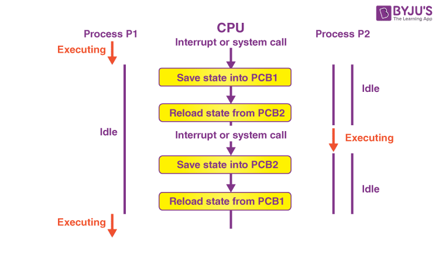

### Context Switching 🔄

Context switching is a crucial mechanism in operating systems that allows for multitasking. It involves the process of storing and restoring the state of a CPU so that multiple processes can share a single CPU resource. Let’s dive into the details.

#### Definition

**Context Switching** is the process of saving the state of a currently running process or thread and restoring the state of another process or thread. This allows multiple processes to execute on a single CPU by switching between them.

---

#### Why Context Switching is Important

1. **Multitasking** 🖥️

   - Enables multiple processes to run seemingly simultaneously, improving system responsiveness.
2. **Resource Utilization** 🌟

   - Ensures efficient use of CPU time by switching to another process when one is waiting for I/O operations.
3. **Fairness** ⚖️

   - Allows equitable distribution of CPU time among multiple processes or threads.

---

#### Steps Involved in Context Switching

1. **Save the State of the Current Process** 📝

   - The current process's state is saved in its Process Control Block (PCB). This includes:
     - Program Counter (PC) 🎯
     - CPU registers 📊
     - Memory management information 🧠
2. **Update the Process Control Block (PCB)** 📋

   - The PCB is updated with the process's current state so it can be resumed later.
3. **Select the Next Process to Run** 🎯

   - The OS scheduler selects another process from the ready queue based on the scheduling algorithm.
4. **Restore the State of the Next Process** 🗂️

   - The state of the selected process is loaded from its PCB, restoring:
     - Program Counter (PC) 🎯
     - CPU registers 📊
     - Memory management information 🧠
5. **Resume Execution** ▶️

   - The CPU starts executing the next process from where it left off.

---

#### Types of Context Switching

1. **Process Context Switching** 📝

   - Switching between processes.
   - More complex due to the need to switch memory spaces and resources.
2. **Thread Context Switching** 🧵

   - Switching between threads within the same process.
   - Generally faster as threads share the same memory space and resources.

---

#### Context Switching Overhead

**Overhead** refers to the time and resources required to perform a context switch. While context switching allows multitasking, it introduces some overhead:

1. **CPU Time** ⏳

   - Time taken to save and restore states.
2. **Memory Bandwidth** 💾

   - Accessing and updating PCB data in memory.
3. **Cache Performance** 🗂️

   - CPU caches may need to be reloaded, affecting performance.

Despite the overhead, context switching is necessary for efficient multitasking and resource management in an OS.

---

#### Context Switching and Scheduling

Context switching is closely tied to the scheduling algorithm used by the OS. Different algorithms may affect the frequency and efficiency of context switches:

1. **Round Robin (RR)** 🔄

   - Frequent context switches as each process gets a fixed time slice.
2. **Priority Scheduling** 🎖️

   - Context switches based on process priority.
3. **Shortest Job Next (SJN)** ⏳

   - Context switches to execute the shortest remaining process.

---

#### Practical Example

Imagine you are using a computer to write a document while also browsing the web and listening to music. Here’s how context switching plays a role:

1. **Writing a Document** 📄

   - The word processor is the active process.
   - When you stop typing, the OS may switch to another process.
2. **Browsing the Web** 🌐

   - The web browser becomes the active process.
   - While waiting for a webpage to load, the OS can switch again.
3. **Listening to Music** 🎶

   - The music player process runs in the background.
   - The OS switches to it intermittently to process audio playback.
4. **Context Switch** 🔄

   - Each switch involves saving the state of the current process and loading the state of the next process.

---

# Questions on Context Switching

Great! Let's explore questions about context switching in an operating system. I'll structure them from basic to advanced with detailed answers and interactive elements.

### Basic Level

1. **What is context switching in an operating system? 🔄****Answer:**Context switching is the process of saving the state of a currently running process and loading the state of the next process to be executed. This allows the CPU to switch from executing one process to another.
2. **Why is context switching necessary in a multitasking operating system? 🤔****Answer:**Context switching is necessary to enable multitasking, allowing multiple processes to share the CPU. It ensures that each process gets a fair share of CPU time and can make progress.
3. **What information is saved during a context switch? 📋**
   **Answer:**
   During a context switch, the operating system saves the process's CPU registers, program counter, and process state in its Process Control Block (PCB). This ensures the process can resume from where it left off.

### Intermediate Level

4. **How does the operating system minimize the overhead of context switching? 💡****Answer:**The OS minimizes context switching overhead by optimizing the scheduler, reducing the frequency of context switches, and using efficient data structures to store process states.
5. **Explain the role of the scheduler in context switching. 🗓️****Answer:**The scheduler decides which process to execute next based on a scheduling algorithm. It uses information from PCBs to determine the next process and initiates the context switch by saving the current process state and loading the next process state.
6. **What is a context switch time, and why is it important? ⏱️**
   **Answer:**
   Context switch time is the time taken to switch the CPU from one process to another. It is important because it adds to the overall system overhead. Lower context switch times improve system efficiency and performance.

### Advanced Level

7. **Discuss the impact of context switching on system performance. ⚙️****Answer:**Frequent context switching can degrade system performance due to the overhead of saving and loading process states. It can increase CPU time spent on switching rather than executing processes. Efficient scheduling algorithms help mitigate this impact.
8. **How do modern operating systems handle context switching for multi-threaded processes? 🧵****Answer:**Modern OSes handle context switching for multi-threaded processes by saving and loading thread-specific information. Each thread has its own PCB-like structure, ensuring that thread states are maintained separately, allowing smooth transitions between threads.
9. **What are some common techniques used to optimize context switching in real-time systems? 🚀**
   **Answer:**
   Techniques to optimize context switching in real-time systems include priority-based scheduling, reducing interrupt latency, using lightweight context switches, and avoiding unnecessary context switches through cooperative multitasking.

### More Questions

### Basic Level

10. **What is the difference between a context switch and a mode switch? 🔄 vs 🔁****Answer:**A context switch involves changing the CPU from one process to another, saving and loading process states. A mode switch involves changing the CPU mode from user mode to kernel mode or vice versa, typically during system calls or interrupts.
11. **What is the role of the program counter during a context switch? 📍**
    **Answer:**
    The program counter holds the address of the next instruction to execute. During a context switch, the OS saves the current process's program counter value and loads the program counter of the next process, ensuring correct execution flow.

### Intermediate Level

12. **How does preemptive scheduling affect context switching? ⏳****Answer:**Preemptive scheduling allows the OS to forcibly switch the CPU from one process to another, based on priority or time slice expiration. This increases the frequency of context switches but ensures responsive multitasking.
13. **What challenges do operating systems face with frequent context switching? 🚧**
    **Answer:**
    Challenges include increased CPU overhead, potential cache invalidation, higher memory usage for storing process states, and synchronization issues between processes.

### Advanced Level

14. **How does hardware support, like the Translation Lookaside Buffer (TLB), impact context switching? 🛠️****Answer:**Hardware support like TLB helps speed up memory access by caching page table entries. During a context switch, TLB entries might need to be flushed, impacting performance. Some systems use TLB tagging to reduce this overhead.
15. **Explain how context switching works in virtualized environments. 🌐**
    **Answer:**
    In virtualized environments, context switching involves switching between virtual machines (VMs) as well as processes within VMs. The hypervisor manages VM states and performs context switches at both the VM and process levels, adding additional layers of complexity and overhead.
