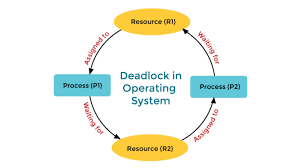

# Detailed Overview of Deadlocks in Operating Systems 🚧


#### Necessary Conditions for Deadlock

To understand deadlocks comprehensively, it's crucial to delve deeper into the four Coffman conditions that must hold simultaneously for a deadlock to occur:

1. **Mutual Exclusion** 🛑

   - **Explanation**: Only one process can use a resource at any given time.
   - **Example**: If a printer is being used by one process, no other process can use it until the current process releases it.
2. **Hold and Wait** ⏳

   - **Explanation**: A process holding at least one resource is waiting to acquire additional resources held by other processes.
   - **Example**: A process has acquired a file lock and is waiting for access to the printer, which is held by another process.
3. **No Preemption** 🚫

   - **Explanation**: Resources cannot be forcibly taken away from a process. The process must release resources voluntarily.
   - **Example**: If a process has locked a file, the OS cannot forcibly unlock the file; the process must unlock it after completing its task.
4. **Circular Wait** 🔄

   - **Explanation**: There exists a set of processes {P1, P2, ..., Pn} such that P1 is waiting for a resource held by P2, P2 is waiting for a resource held by P3, and so on, with Pn waiting for a resource held by P1.
   - **Example**: Process A holds Resource 1 and waits for Resource 2, which is held by Process B. Process B waits for Resource 3, held by Process C. Process C waits for Resource 1, held by Process A.

---




#### Deadlock Prevention Strategies

Deadlock prevention strategies focus on ensuring that at least one of the necessary conditions for deadlock cannot hold. Here are detailed strategies for each condition:

1. **Mutual Exclusion** 🛑

   - **Strategy**: Convert resources to sharable resources where possible.
   - **Example**: Use spooling for printers where multiple processes can print to a spool file, and the printer reads from the spool.
2. **Hold and Wait** ⏳

   - **Strategy 1**: Require all resources to be requested at the start of the process.
   - **Strategy 2**: Ensure processes release all held resources before requesting new ones.
   - **Example**: Processes must request all needed resources (e.g., files, printers) before starting execution, which can lead to poor resource utilization.
3. **No Preemption** 🚫

   - **Strategy**: Allow preemption of resources.
   - **Example**: If a process holding some resources requests additional resources that cannot be allocated immediately, the OS preempts the process's currently held resources, allocates them to the requesting process, and places the preempted process in a waiting state.
4. **Circular Wait** 🔄

   - **Strategy**: Impose an order on the resources and ensure that processes request resources in increasing order of enumeration.
   - **Example**: If resources are ordered as {R1, R2, R3}, a process holding R1 can only request R2 or R3, but not R1 again.

---

#### Deadlock Avoidance

Deadlock avoidance involves dynamically checking resource-allocation state to ensure that a circular wait condition can never exist. The Banker's Algorithm is a common deadlock avoidance algorithm.

1. **Banker's Algorithm** 🏦

   - **Purpose**: Ensures that the system remains in a safe state where resources can always be allocated in some order to avoid deadlock.
   - **Mechanism**:
     - **Safe State**: A state where the system can allocate resources to each process in some order and avoid deadlock.
     - **Steps**:
       1. **Request**: A process requests resources.
       2. **Pretend Allocation**: The system pretends to allocate resources and checks for a safe state.
       3. **Grant/Reject**: If the state remains safe, the resources are allocated. If not, the request is denied, and the process must wait.

   **Example**:

   ```plaintext
   Processes: P1, P2, P3
   Resources: A, B, C

   Allocation Matrix:
        A B C
   P1   0 1 0
   P2   2 0 0
   P3   3 0 2

   Maximum Need Matrix:
        A B C
   P1   7 5 3
   P2   3 2 2
   P3   9 0 2

   Available Resources:
        A B C
        3 3 2

   Request: P1 requests (0, 2, 0)
   Check if granting request keeps system in a safe state.
   ```

---

#### Deadlock Detection and Recovery

When prevention and avoidance are impractical, the OS must detect and recover from deadlocks.

1. **Deadlock Detection** 🔍

   - **Mechanism**: Periodically check the state of the system for deadlocks by examining the resource allocation graph (RAG) or using a wait-for graph.
   - **Wait-for Graph**:
     - **Definition**: A simplified RAG where only waiting relationships are represented.
     - **Cycle Detection**: Use algorithms like depth-first search (DFS) to detect cycles in the graph, indicating deadlocks.

   **Example**:

   ```plaintext
   Wait-for Graph:
        P1 -> P2
        P2 -> P3
        P3 -> P1

   Cycle detected: P1 -> P2 -> P3 -> P1
   Deadlock exists.
   ```
2. **Deadlock Recovery** 🛠️

   - **Process Termination**:
     - **Abort All Deadlocked Processes**: Simplest but most expensive.
     - **Abort One Process at a Time**: Select processes for termination based on criteria like priority, runtime, or resource usage until the deadlock is resolved.
   - **Resource Preemption**:
     - **Mechanism**: Preempt resources from some processes and allocate them to others to break the deadlock.
     - **Rollback**: Rollback processes to a safe state, requiring the system to maintain checkpoints of resource allocation states.

   **Example**:

   ```plaintext
   Cycle detected in wait-for graph:
        P1 -> P2 -> P3 -> P1

   Recovery Strategy:
        - Terminate P2 (least priority)
        - Preempt resources held by P2 and allocate to P1 and P3
   ```

---

#### Practical Considerations

1. **Handling Circular Wait** 🔄

   - **Practical Implementation**: Design resource acquisition policies where resources are requested and released in a predefined order to avoid circular wait.
2. **Monitoring and Logging** 📊

   - **Best Practices**: Implement comprehensive monitoring and logging to detect and analyze deadlocks in real-time, enabling faster recovery and better understanding of resource usage patterns.
3. **User Notification** 📢

   - **User Impact**: Provide mechanisms to notify users of potential deadlocks and the actions being taken to resolve them to maintain user confidence and transparency.

---

#### Example Scenario

Consider a real-world example of a file-sharing system where multiple users access shared files and printers.

1. **Initial State**:
   - **User A**: Holds File 1, waiting for Printer.
   - **User B**: Holds Printer, waiting for File 2.
   - **User C**: Holds File 2, waiting for File 1.

**Resource Allocation Graph**:

```plaintext
User A -> Printer
File 1 -> User A
User B -> File 2
Printer -> User B
User C -> File 1
File 2 -> User C
```

**Cycle**:

- **User A -> Printer -> User B -> File 2 -> User C -> File 1 -> User A**
- Deadlock detected.

**Deadlock Prevention**:

- **Hold and Wait**: Users must request all files and printers they need at the start of the session.

**Deadlock Avoidance (Banker's Algorithm)**:

- **Safe Sequence Check**: Evaluate if granting User A's request keeps the system in a safe state.

**Deadlock Detection and Recovery**:

- **Detection**: Use the Wait-for Graph to detect cycles.
- **Recovery**: Preempt the printer from User B, allocate it to User A, and resolve the deadlock.

# Questions on Deadlock 😎


### Basic Level

1. **What is a deadlock in an operating system? 🚫🔄****Answer:**A deadlock is a situation in an operating system where a set of processes is unable to proceed because each process is waiting for a resource that is held by another process in the set. This creates a cycle of dependencies with no process able to complete.
2. **Name the four necessary conditions for a deadlock to occur. 📜****Answer:**The four necessary conditions for a deadlock to occur are:

   - **Mutual Exclusion:** At least one resource must be held in a non-shareable mode.
   - **Hold and Wait:** A process holding at least one resource is waiting to acquire additional resources held by other processes.
   - **No Preemption:** Resources cannot be forcibly removed from processes holding them.
   - **Circular Wait:** A set of processes is waiting in a circular chain such that each process is waiting for a resource held by the next process in the chain.
3. **What is the difference between deadlock and starvation? 🌑 vs 🌟****Answer:**

   - **Deadlock:** A situation where a set of processes is stuck in a state where none can proceed due to mutual resource dependency.
   - **Starvation:** A situation where a process is perpetually denied necessary resources to proceed, often due to other processes continually getting priority.

### Intermediate Level

4. **How can an operating system prevent deadlocks? 🚧****Answer:**An OS can prevent deadlocks by ensuring that at least one of the necessary conditions for deadlocks is never satisfied. This can be achieved through:

   - **Mutual Exclusion:** Avoid making resources exclusively non-shareable.
   - **Hold and Wait:** Require processes to request all needed resources simultaneously.
   - **No Preemption:** Allow the OS to forcibly take away resources from processes.
   - **Circular Wait:** Impose an ordering on resource acquisition.
5. **Explain the Banker's Algorithm for deadlock avoidance. 🏦****Answer:**The Banker's Algorithm is a deadlock avoidance algorithm that simulates resource allocation to ensure the system remains in a safe state. It checks whether resources can be allocated to processes without leading to a deadlock by:

   - Calculating the maximum possible resource needs for each process.
   - Determining if resources can be allocated safely.
   - Ensuring that after allocation, at least one sequence of resource releases exists to satisfy all processes.
6. **What is the role of a resource allocation graph in deadlock detection? 📊**
   **Answer:**
   A resource allocation graph represents processes and resources as nodes, with edges indicating resource allocation and requests. Deadlocks can be detected by identifying cycles in this graph. If a cycle exists, the system is in a deadlocked state.

### Advanced Level

7. **Discuss the trade-offs between deadlock prevention and deadlock avoidance. ⚖️****Answer:**

   - **Deadlock Prevention:** Involves imposing restrictions to ensure deadlocks never occur. This can lead to inefficient resource utilization and reduced system performance due to conservative resource allocation policies.
   - **Deadlock Avoidance:** Dynamically checks resource allocation to ensure the system remains in a safe state. It allows for more flexible resource usage but requires complex algorithms and continuous monitoring, which can increase overhead.
8. **How does the Ostrich Algorithm handle deadlocks, and what are its implications? 🐦‍⬛****Answer:**The Ostrich Algorithm simply ignores the possibility of deadlocks, under the assumption that they occur infrequently and the cost of prevention/avoidance is higher than the cost of dealing with them when they occur. While this can simplify system design, it can also lead to potential system halts when deadlocks do occur.
9. **Explain the concept of deadlock recovery and the methods used. 💡****Answer:**Deadlock recovery involves taking action after a deadlock is detected to break the cycle of dependencies. Methods include:

   - **Process Termination:** Abort one or more processes involved in the deadlock to release resources.
   - **Resource Preemption:** Temporarily take resources from some processes and allocate them to others to break the deadlock.

### More Deep Concepts

### Basic Level

10. **What is the Coffman condition in the context of deadlocks? 📜****Answer:**The Coffman conditions are the four necessary conditions (mutual exclusion, hold and wait, no preemption, circular wait) that must all be present for a deadlock to occur. They are used to analyze and prevent deadlocks in operating systems.
11. **How does the "no preemption" condition contribute to deadlocks? 🚫**
    **Answer:**
    The "no preemption" condition means that a resource cannot be forcibly taken away from a process holding it. This contributes to deadlocks by allowing processes to hold resources indefinitely while waiting for other resources, creating a potential for circular waits.

### Intermediate Level

12. **Describe the concept of safe and unsafe states in deadlock avoidance. 🚥****Answer:**

    - **Safe State:** A state where the system can allocate resources to each process in some order and still avoid a deadlock. All processes can complete successfully.
    - **Unsafe State:** A state where there is no guarantee that all processes can complete, leading to a potential deadlock if resource allocation is not managed carefully.
13. **How can the "wait-for" graph be used to detect deadlocks in a system? 🌐**
    **Answer:**
    A "wait-for" graph is a simplified resource allocation graph where edges represent processes waiting for other processes to release resources. Deadlocks can be detected by finding cycles in this graph. If a cycle exists, the system is deadlocked.

### Advanced Level

14. **What are the limitations of using the Banker's Algorithm for deadlock avoidance? 🏦🔄****Answer:**

    - **Resource Estimation:** Requires processes to declare their maximum resource needs in advance, which may not always be feasible.
    - **Complexity:** Involves significant computational overhead to continuously check for safe states.
    - **Limited Scalability:** Can become inefficient with a large number of processes and resources.
15. **Discuss the concept of livelock and how it differs from deadlock. 🔄 vs 🚫****Answer:**

    - **Deadlock:** Processes are blocked, waiting for each other indefinitely.
    - **Livelock:** Processes are not blocked but continuously change states without making progress. They remain active but unable to complete their tasks due to constantly interfering with each other.
16. **Explain the Dining Philosophers Problem and its significance in studying deadlocks. 🍽️****Answer:**The Dining Philosophers Problem is a classic synchronization problem that illustrates the challenges of allocating limited resources (forks) among multiple processes (philosophers) without causing deadlocks. It helps in understanding and designing deadlock-free resource allocation protocols.
17. **How can deadlock detection algorithms be optimized for performance? 🚀****Answer:**Deadlock detection algorithms can be optimized by:

    - **Reducing Frequency:** Running detection checks periodically rather than continuously.
    - **Efficient Data Structures:** Using efficient data structures (like adjacency lists) for representing graphs.
    - **Incremental Detection:** Checking only the newly added or modified parts of the graph for cycles.

I hope these additional questions and detailed answers provide a deeper understanding and help you prepare thoroughly for your interviews! If you need more topics or further clarification, feel free to ask. 😊👍
