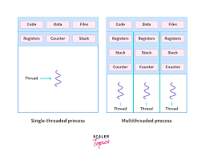

# Threads in Java 🧵

Threads in Java are essential for building concurrent applications. Java provides a robust and easy-to-use model for multithreading, allowing developers to create applications that can perform multiple tasks simultaneously. Let's explore everything you need to know about threads in Java.

---



#### Definition

**Thread**: A thread is a lightweight subprocess, the smallest unit of processing. It is a separate path of execution within a program. Java's `java.lang.Thread` class is used to create and manage threads.

---

#### Why Use Threads?

1. **Concurrency** 🌐

   - Allows multiple tasks to be performed simultaneously, improving application performance and responsiveness.
2. **Resource Sharing** 🛠️

   - Threads within the same process share resources, such as memory, which can be more efficient than using multiple processes.
3. **Responsiveness** 🏃‍♂️

   - Keeping the user interface responsive while performing background tasks.
4. **Utilizing Multi-core Processors** 💻

   - Modern processors have multiple cores, and multithreading allows applications to utilize these cores efficiently.

---

#### Creating Threads in Java

There are two main ways to create threads in Java:

1. **Extending the `Thread` Class**

   - **Mechanism**: Create a new class that extends `Thread` and override the `run()` method.
   - **Example**:
     ```java
     class MyThread extends Thread {
         public void run() {
             System.out.println("Thread is running");
         }
     }

     public class TestThread {
         public static void main(String[] args) {
             MyThread t1 = new MyThread();
             t1.start();  // Start the thread
         }
     }
     ```
2. **Implementing the `Runnable` Interface**

   - **Mechanism**: Create a class that implements the `Runnable` interface and implement the `run()` method. Pass an instance of the class to a `Thread` object and call `start()`.
   - **Example**:
     ```java
     class MyRunnable implements Runnable {
         public void run() {
             System.out.println("Thread is running");
         }
     }

     public class TestRunnable {
         public static void main(String[] args) {
             MyRunnable myRunnable = new MyRunnable();
             Thread t1 = new Thread(myRunnable);
             t1.start();  // Start the thread
         }
     }
     ```

---

#### Thread Lifecycle

Threads in Java go through several states during their lifecycle:

1. **New** 🌱

   - A thread that is created but not yet started.
   - **Code**: `Thread t = new Thread();`
2. **Runnable** 🎬

   - A thread that is ready to run and waiting for CPU allocation.
   - **Code**: `t.start();`
3. **Running** 🏃‍♂️

   - A thread that is currently executing.
   - **Code**: The `run()` method is being executed.
4. **Blocked/Waiting** ⏳

   - A thread that is waiting for a resource or another thread to perform an action.
   - **Code**: `t.wait();` or `t.join();`
5. **Timed Waiting** ⏲️

   - A thread that is waiting for a specified amount of time.
   - **Code**: `t.sleep(1000);`
6. **Terminated** 🛑

   - A thread that has completed its execution.
   - **Code**: The `run()` method has finished.

---

#### Thread Methods

Java provides several methods to control the behavior of threads:

1. **`start()`** 🎬

   - Starts the thread.
   - **Code**: `t.start();`
2. **`run()`** 🏃‍♂️

   - Contains the code to be executed by the thread.
   - **Code**: `public void run() { ... }`
3. **`sleep(long millis)`** 😴

   - Makes the thread sleep for the specified number of milliseconds.
   - **Code**: `Thread.sleep(1000);`
4. **`join()`** ⏳

   - Waits for the thread to die.
   - **Code**: `t.join();`
5. **`yield()`** 🔄

   - Pauses the currently executing thread to allow other threads to execute.
   - **Code**: `Thread.yield();`
6. **`interrupt()`** 🚨

   - Interrupts the thread.
   - **Code**: `t.interrupt();`
7. **`isAlive()`** 🔍

   - Checks if the thread is still running.
   - **Code**: `t.isAlive();`

---

#### Synchronization

Synchronization is crucial when multiple threads access shared resources to prevent data inconsistency and ensure thread safety.

1. **Synchronized Methods** 🔒

   - Methods can be synchronized to allow only one thread to access them at a time.
   - **Code**:
     ```java
     public synchronized void synchronizedMethod() {
         // Code
     }
     ```
2. **Synchronized Blocks** 🔒

   - Blocks within methods can be synchronized to lock on a particular object.
   - **Code**:
     ```java
     public void method() {
         synchronized(this) {
             // Code
         }
     }
     ```
3. **Static Synchronization** 🔒

   - Static methods can also be synchronized.
   - **Code**:
     ```java
     public static synchronized void staticSynchronizedMethod() {
         // Code
     }
     ```

**Example**:

```java
class Counter {
    private int count = 0;

    public synchronized void increment() {
        count++;
    }

    public int getCount() {
        return count;
    }
}

public class TestSync {
    public static void main(String[] args) throws InterruptedException {
        Counter counter = new Counter();

        Thread t1 = new Thread(() -> {
            for (int i = 0; i < 1000; i++) {
                counter.increment();
            }
        });

        Thread t2 = new Thread(() -> {
            for (int i = 0; i < 1000; i++) {
                counter.increment();
            }
        });

        t1.start();
        t2.start();

        t1.join();
        t2.join();

        System.out.println("Count: " + counter.getCount());
    }
}
```

---

#### Inter-Thread Communication

Java provides a way for threads to communicate with each other using the `wait()`, `notify()`, and `notifyAll()` methods.

1. **`wait()`** ⏳

   - Causes the current thread to wait until another thread invokes `notify()` or `notifyAll()` on the same object.
   - **Code**: `synchronized(obj) { obj.wait(); }`
2. **`notify()`** 🔔

   - Wakes up a single thread that is waiting on the object's monitor.
   - **Code**: `synchronized(obj) { obj.notify(); }`
3. **`notifyAll()`** 🔔🔔

   - Wakes up all threads that are waiting on the object's monitor.
   - **Code**: `synchronized(obj) { obj.notifyAll(); }`

**Example**:

```java
class SharedResource {
    private boolean flag = false;

    public synchronized void produce() throws InterruptedException {
        while (flag) {
            wait();
        }
        System.out.println("Produced");
        flag = true;
        notify();
    }

    public synchronized void consume() throws InterruptedException {
        while (!flag) {
            wait();
        }
        System.out.println("Consumed");
        flag = false;
        notify();
    }
}

public class TestInterThread {
    public static void main(String[] args) {
        SharedResource resource = new SharedResource();

        Thread producer = new Thread(() -> {
            try {
                resource.produce();
            } catch (InterruptedException e) {
                Thread.currentThread().interrupt();
            }
        });

        Thread consumer = new Thread(() -> {
            try {
                resource.consume();
            } catch (InterruptedException e) {
                Thread.currentThread().interrupt();
            }
        });

        producer.start();
        consumer.start();
    }
}
```

---

#### Thread Pools

Java provides the `Executor` framework to manage a pool of worker threads.

1. **Fixed Thread Pool** 🔢

   - A thread pool with a fixed number of threads.
   - **Code**:
     ```java
     ExecutorService executor = Executors.newFixedThreadPool(5);
     for (int i = 0; i < 10; i++) {
         executor.submit(() -> {
             System.out.println("Task executed by " + Thread.currentThread().getName());
         });
     }
     executor.shutdown();
     ```
2. **Cached Thread Pool** 📈

   - A thread pool that creates new threads as needed but reuses previously constructed threads when they are available.
   - **Code**:
     ```java
     ExecutorService executor = Executors.newCachedThreadPool();
     for (int i = 0; i < 10; i++) {
         executor.submit(() -> {
             System.out.println("Task executed by " + Thread.currentThread().getName());
         });
     }
     executor.shutdown();
     ```
3. **Scheduled Thread Pool** 📅

   - A thread pool that can schedule commands to run after a given delay or to execute periodically.
   - **Code**:
     ```java
     ScheduledExecutorService executor = Executors.newScheduledThreadPool(5);
     executor.schedule(() -> {
         System.out.println("Scheduled task executed by " + Thread.currentThread().getName());
     }, 5,

     ```

 TimeUnit.SECONDS);
     executor.shutdown();
     ```

---

#### Best Practices

1. **Use Thread Pools** 🏊‍♂️

   - Use the `Executor` framework instead of creating threads manually to manage thread life cycle efficiently.
2. **Minimize Synchronization** 🔒

   - Synchronize only the necessary parts of the code to reduce contention and improve performance.
3. **Handle InterruptedException** ⚠️

   - Properly handle `InterruptedException` to maintain thread responsiveness and manage cleanup.
4. **Avoid Deadlocks** 🚧

   - Design thread synchronization carefully to prevent deadlocks.
5. **Use High-Level Concurrency Utilities** 🛠️

   - Utilize `java.util.concurrent` package utilities such as `CountDownLatch`, `CyclicBarrier`, and `Semaphore` for advanced synchronization.

---

# Multithreading Models in Operating Systems 🧵

Multithreading models describe how user-level threads are mapped to kernel-level threads. Understanding these models is crucial for designing efficient multithreaded applications and optimizing resource utilization. Let's explore the different multithreading models in detail.

---

#### Types of Multithreading Models

1. **Many-to-One Model** 🕸️
2. **One-to-One Model** 🌐
3. **Many-to-Many Model** 🔄

---

### 1. Many-to-One Model 🕸️

**Mechanism**:

- Maps many user-level threads to a single kernel thread.
- All user threads are managed by a single thread in the kernel.
- The thread management is performed in user space by a thread library, not by the kernel.

**Advantages**:

- Efficient in terms of thread creation and management.
- No need for kernel mode switching, making it faster.

**Disadvantages**:

- If one thread makes a blocking system call, the entire process is blocked.
- Cannot run in parallel on a multiprocessor system because only one kernel thread is used.

**Example**:

- The Green Threads library in early Java versions used this model.
- Pthreads library can be implemented on systems like Solaris using this model.

**Diagram**:

```plaintext
User Threads: T1 T2 T3
Kernel Thread: KT1
```

### 2. One-to-One Model 🌐

**Mechanism**:

- Maps each user-level thread to a kernel thread.
- Allows multiple threads within the same process to run in parallel on multiple processors.

**Advantages**:

- More concurrency as each thread is treated independently.
- If one thread blocks, other threads can continue to execute.

**Disadvantages**:

- Higher overhead due to the need for creating a corresponding kernel thread for each user thread.
- Limited by the number of threads that can be created because each user thread maps to a kernel thread.

**Example**:

- Windows operating system uses this model.
- Linux and modern versions of Solaris also use this model.

**Diagram**:

```plaintext
User Threads: T1 T2 T3
Kernel Threads: KT1 KT2 KT3
```

### 3. Many-to-Many Model 🔄

**Mechanism**:

- Multiplexes many user-level threads to a smaller or equal number of kernel threads.
- The number of kernel threads can be greater than or equal to the number of processors.

**Advantages**:

- Greater flexibility because the OS can create a sufficient number of kernel threads.
- If one user thread blocks, the kernel can schedule another kernel thread to run another user thread.

**Disadvantages**:

- More complex to implement and manage.
- Still requires a level of kernel-level threading support.

**Example**:

- Windows with the ThreadFiber package.
- Some versions of the Solaris operating system.

**Diagram**:

```plaintext
User Threads: T1 T2 T3 T4 T5
Kernel Threads: KT1 KT2 KT3
```

---

### Hybrid Model 🌐🔄

**Mechanism**:

- Combines aspects of the One-to-One and Many-to-Many models.
- Allows some threads to be bound to kernel threads and some to be managed by a many-to-many model.

**Advantages**:

- Provides the benefits of both one-to-one and many-to-many models.
- Optimizes for both concurrency and resource utilization.

**Disadvantages**:

- Complex to implement and manage.

**Example**:

- Windows operating system with certain configurations.
- Some modern Unix-based operating systems.

**Diagram**:

```plaintext
User Threads: T1 T2 T3
Kernel Threads: KT1 KT2 KT3
Some user threads directly mapped, some multiplexed.
```

---

### Key Considerations

1. **Thread Management Overhead**:

   - Creating and managing kernel threads can be more expensive than managing user-level threads.
   - The choice of model affects the overhead involved in thread management.
2. **Concurrency and Performance**:

   - The ability to run threads in parallel on multiple processors can significantly improve performance.
   - One-to-One and Many-to-Many models offer better concurrency compared to the Many-to-One model.
3. **System Support**:

   - The underlying operating system must support the chosen multithreading model.
   - Different operating systems may have different implementations and levels of support for these models.
4. **Application Requirements**:

   - The nature of the application (e.g., compute-intensive, I/O-bound) can influence the choice of threading model.
   - Applications requiring high concurrency and responsiveness benefit from models that support better parallelism.

---
